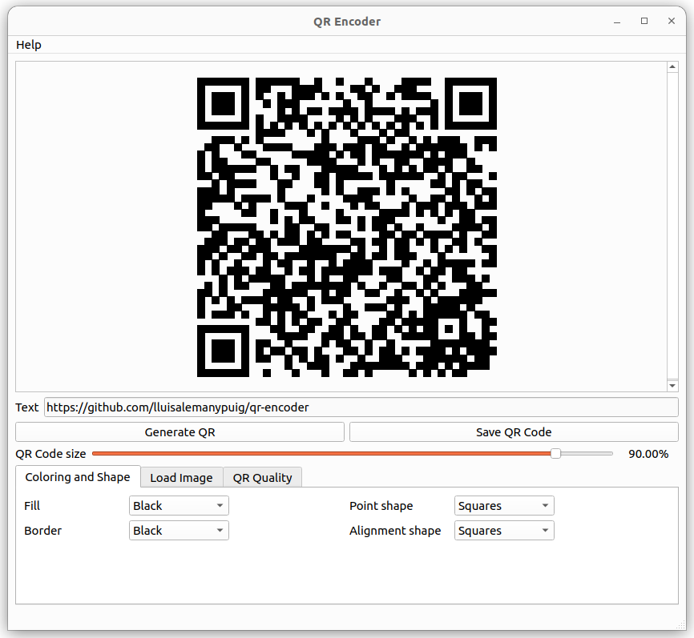
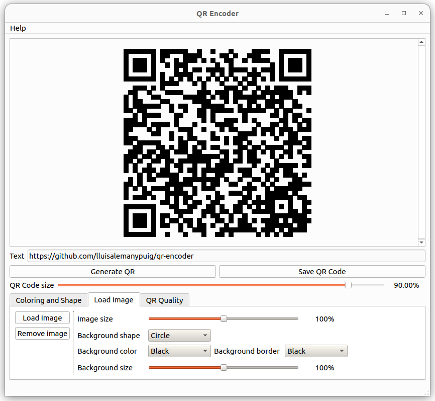
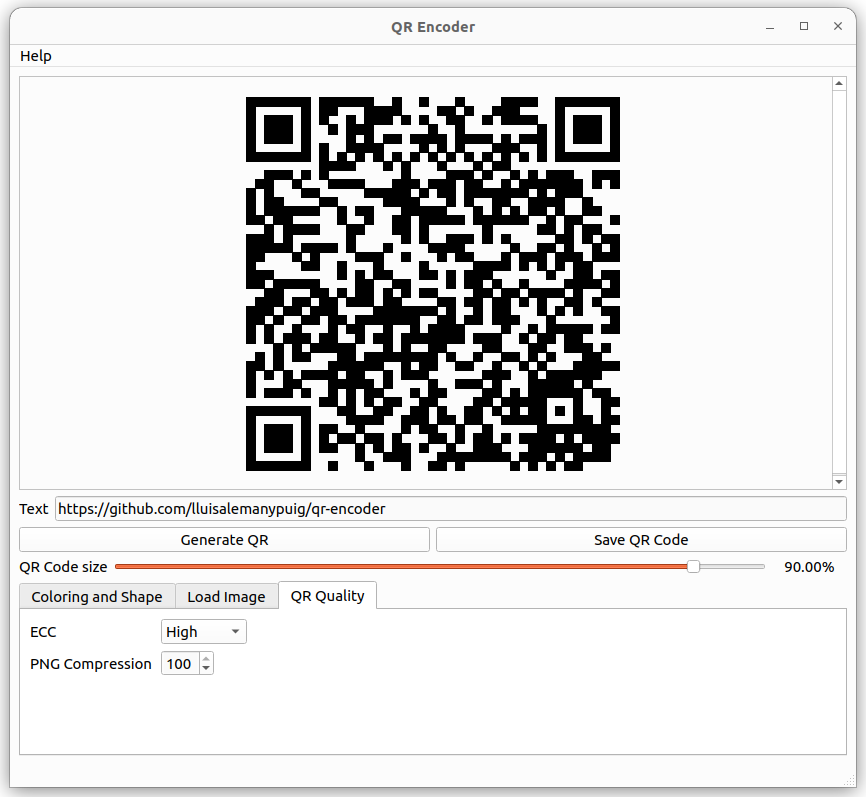

# QR encoder

A small GUI to generate QR codes out of a text provided by the user. To implement the GUI, this project uses [Qt 6.6](https://doc.qt.io/). To generate the QR codes, this application uses [Nayuki's QR Code generator](https://github.com/nayuki/QR-Code-generator); see also [this webpage](https://www.nayuki.io/page/qr-code-generator-library) for further information.

## How to use QR Encoder

Launch the application and enter the text in the textbox right next to "Text". The text can be anything (including UTF-8 characters) from random characters to an actual sentence. After that click on "Generate QR"; in order to save the QR code as a .png image, click on "Save QR code". The QR code can be shrunk using the slider next to "Shrinking factor" or entering a number next to the slider.

### Coloring and Shape

The color and shape of the 'units' of the QR code can be changed. Users can choose the fill color, the border color, and the shape of the units (either squares or circles).

### Add an image to your QR

An image can be added to the QR code. This app places the image at the center of the QR. This image can be resized using a slider. To enhance visibility of the image, a background can be added; its size, color and shape can also be modified.

### Advanced options

The quality of the QR code can be manipulated by setting a value to ECC (which stands for "Error Correcting Codes"). The default setting, "High", is recommended.

The .png image can be generated with varying degrees of compression. By default, the compression is set to the maximum value "100".

## Translations

This program is available in

- English
- Catalan
- Spanish

## Contributing

This project accepts ideas to enhance the performance of this software and/or add new features to make prettier QR codes.

### Translating

It is important to add the appropriate translations of the messages in the GUI or in pop up messages. To add the translations, use the script `update_translations.sh`; it will help you update the translations for the current existing languages.

First, configure your working environment.  Add to your `PATH` environment variable the path to the executable files:

- `lupdate`: generates the xml files containing the translated texts.
- `linguist`: a GUI to aid in the translation process.
- `lrelease`: compiles the xml files so that the executable files can use the translations.

All of these files can be installed using the `Qt Maintenance Tool` which should already be installed in your system. When installed, they can be found in:

	~/Qt/$v/gcc_64/bin/
	
where `v` is the Qt version installed, e.g., `v=6.6.0`.

Now, you are ready to update the translations.

1. Choose the language `L` you want to translate to. The target languages currently supported by the script are

	- English: `english`
	- Catalan: `catalan`
	- Spanish: `spanish`

2. First run the script with parameters:
	
		$ ./update_translations.sh update $L

	This will update the xml files for the actual translation step.

3. Actually translate the texts:

		$ ./update_translations.sh translate $L
	
4. In order to test your translations, compile the translation files:

		$ ./update_translations.sh compile $L
