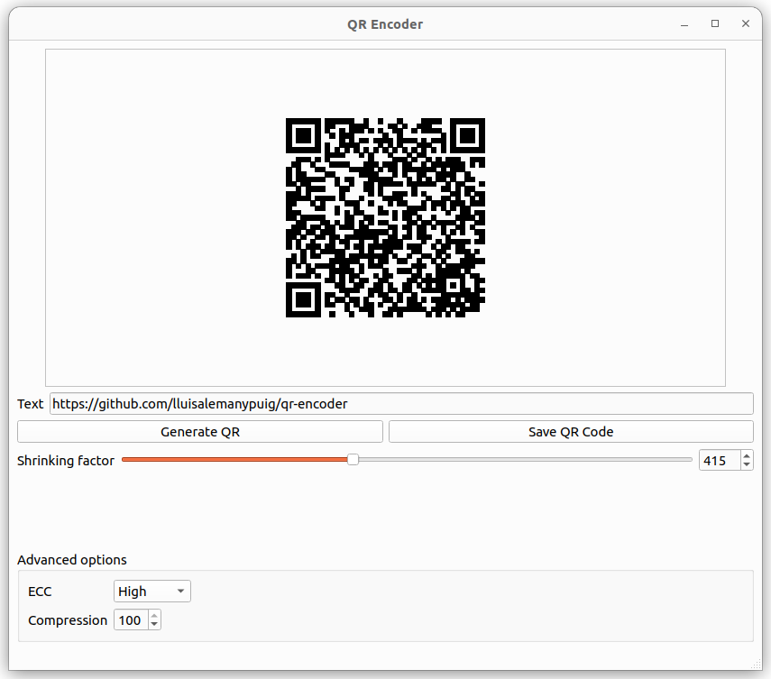

# QR encoder

A small GUI to generate QR codes out of a text provided by the user. To implement the GUI, this project uses [Qt 6.6](https://doc.qt.io/). To generate the QR codes, this application uses [Nayuki's QR Code generator](https://github.com/nayuki/QR-Code-generator); see also [this webpage](https://www.nayuki.io/page/qr-code-generator-library) for further information.

## How to use QR Encoder

Launch the application and enter the text in the textbox right next to "Text". The text can be anything (including UTF-8 characters) from random characters to an actual sentence. After that click on "Generate QR"; in order to save the QR code as a .png image, click on "Save QR code". The QR code can be shrunk using the slider next to "Shrinking factor" or entering a number next to the slider.

### Advanced options

The quality of the QR code can be manipulated by setting a value to ECC (which stands for "Error Correcting Codes"). The default setting, "High", is recommended.

The .png image can be generated with varying degrees of compression. By default, the compression is set to the maximum value "100".

## Translations

This program is available in

- English
- Catalan
- Spanish
